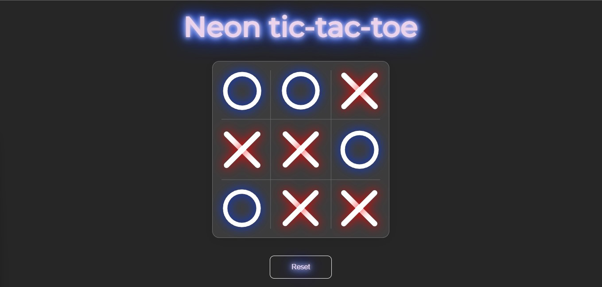

# Neon tic-tac-toe

This repo is a project built from PROGRAMADOR BR course. It is a tic-tac-toe web game build with HTML, CSS, and JavaScript. Using MVC design pattern.

## Screenshot

<h3 align="center">
  
</h3>

## About the project

The objective of the project is to consolidate the knowledge obtained during the course. Applying patterns and programming logic, as well as free and creative design. I decided to opt for a simpler style, but well characterized, with few functionalities.

## Stack used

**Front-end**: HTML, CSS, Javascript

## License

[MIT](https://choosealicense.com/licenses/mit/)
